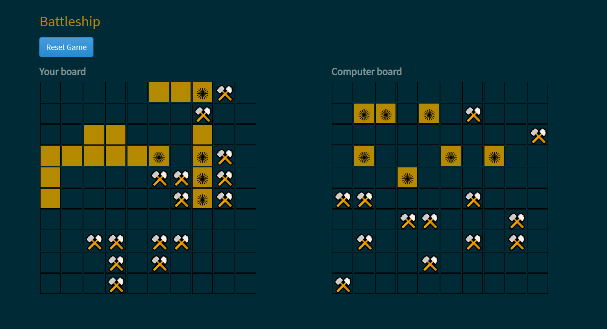

# Battleship

> Battleship is a game played by a human player against the computer. The player attacks the computer by hitting locations on the computer board and vice versa. The player and computer take turns to attack each other by hitting locations on their opponent's board. If the location holds a ship, the ship is hit. The player who sinks all of their opponent's ships first wins the game. 

## Demo

🔥 [Demo](https://rawcdn.githack.com/DanielMitiku/battleship/126ea723ff76f7db65f0803178434633c6c7bf3c/dist/index.html)

## Screenshot



## Built With

- Javascript
- HTML, CSS
- Webpack
- Jest

## Getting Started

To get a local copy up and running follow these simple example steps.

 - Clone this repository to your local machine using ```git clone git@github.com:DanielMitiku/battleship.git```.

 - Run ```cd battleship``` to move into the app directory.

 - Open the ```dist/index.html``` file in your browser.


## Current Features

- User plays against the computer
- User can restart the game
- Computer makes successive moves when it gets a hit

## Features you can add

- Make the game playable againt another person

## Authors

👤 **Moses Ogwo**

- Github: [@mosesogwo](https://github.com/mosesogwo)
- LinkedIn: [@mosesogwo](https://www.linkedin.com/in/mosesogwo/)
- Email: mosesogwo@gmail.com

👤 **Daniel Mitiku**

- Github: [Daniel Mitiku](https://github.com/DanielMitiku)
- LinkedIn: [@daniel-wesego](https://www.linkedin.com/in/daniel-wesego/)
- Email: wedanielmitiku@gmail.com


## 📝 License

This project is [MIT](http://www.tldrlegal.com/license/mit-license) licensed.
